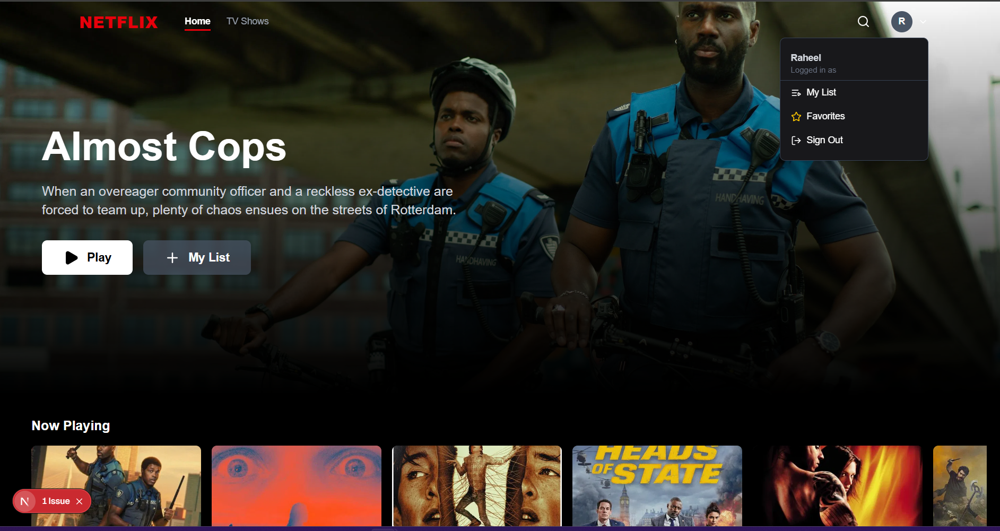
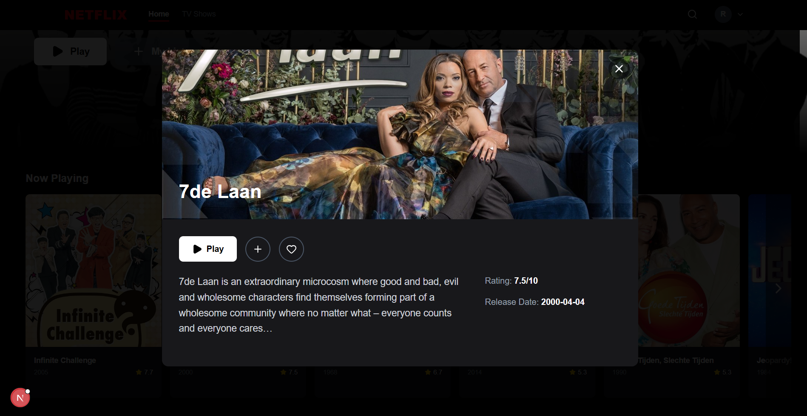
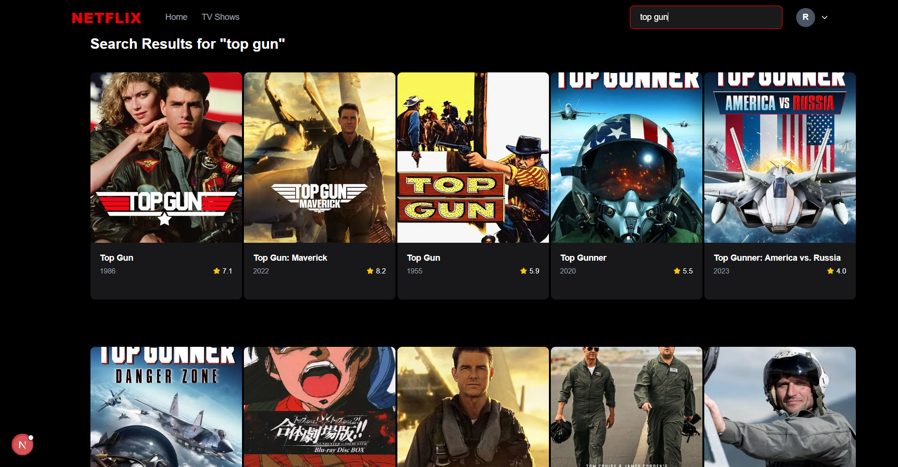
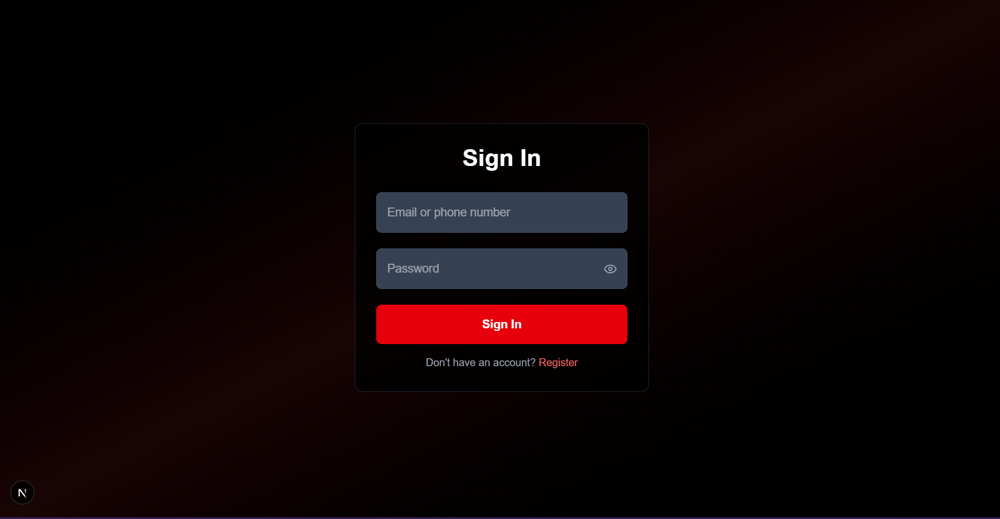

## 📺 Netflix Clone App

A full-featured **Netflix Clone** built using **Next.js**, **TMDB APIs**, and **modern UI/UX**. Users can browse movies & TV shows, add them to **Favourites** or **My List**, and enjoy secure **user-based authentication** with search functionality.

---

### 🚀 Features

* 🔒 **User Authentication** (Login/Signup)
* 🎮 **Browse Movies and TV Shows**
* 📌 **Add to Favourites & My List**
* 🔍 **Search Movies / Series**
* 📱 **Responsive Design**
* 🧠 Powered by **The Movie Database (TMDB)** API

---

### 🖼️ Screenshots

#### 🏠 Home Page



#### 🎥 Movie Info Modal



#### 🔍 Search Interface



#### 🔐 Login Page



---

### ⚙️ Tech Stack

* **Next.js 13+ (App Router)**
* **Tailwind CSS**
* **TMDB API**
* **Firebase / Supabase (for Auth)**
* **React Hooks**

---

### ⚙️ Getting Started

```bash
git clone https://github.com/raheelize/netflix-clone-nextjs.git
cd netflix-clone-nextjs
npm install
npm run dev
```

Create a `.env.local` file with your TMDB API Key and Auth config:

```env
NEXT_PUBLIC_TMDB_API_KEY=your_tmdb_key_here
NEXT_PUBLIC_FIREBASE_API_KEY=your_firebase_key
# or your auth provider keys
```

---

### 📂 Folder Structure

```
/src
    /app               # Next.js App Router pages
    /components        # Reusable UI components
    /pages             # Utility API settings
    /lib               # Conf
/assets/screenshots# Screenshots for documentation
```

---

### 🙌 Credits

* [TMDB API](https://www.themoviedb.org/documentation/api)
* [Next.js](https://nextjs.org/)
* [Tailwind CSS](https://tailwindcss.com/)

---

### 📢 Feedback & Contributions

Pull requests are welcome! If you find bugs or want to suggest improvements, feel free to open an issue or contribute.
